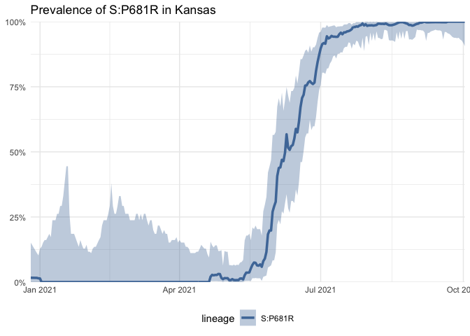
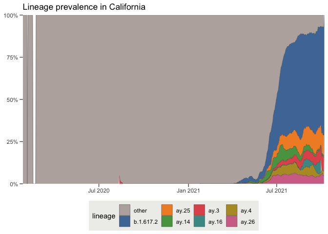
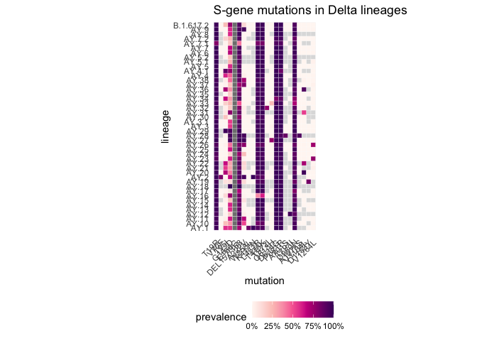
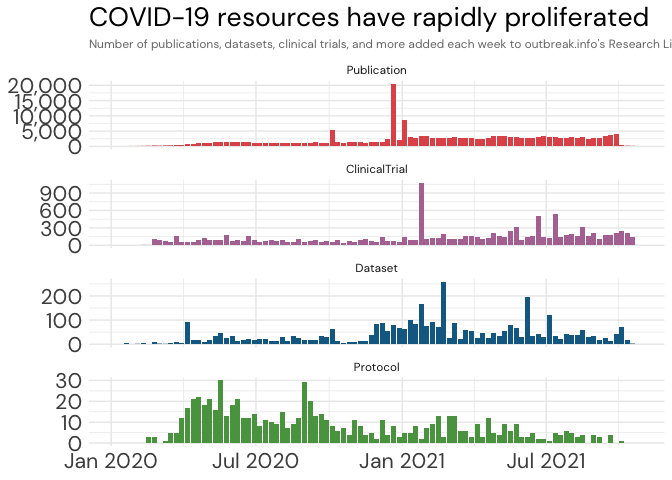
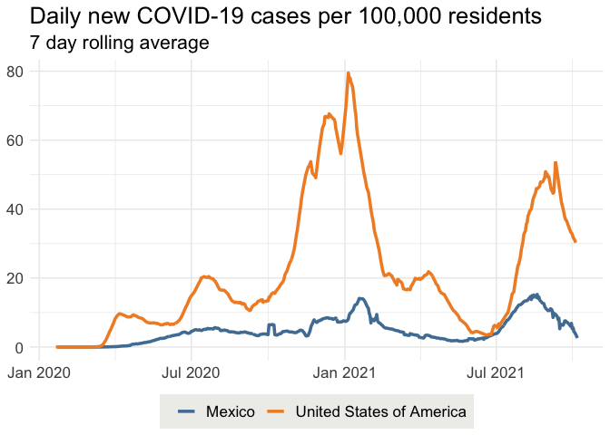

<!-- README.md is generated from README.Rmd. Please edit that file -->


# outbreakinfo 
#### R package for [outbreak.info](https://outbreak.info)

[outbreak.info](https://outbreak.info) is a platform to discover and explore
COVID-19 data and variants. Our [Variant Reports](https://outbreak.info/situation-reports) allow researchers to track any emerging or known variant using customizable
visualizations, enabling near real-time genomic surveillance. Our
[Epidemiology tools](https://outbreak.info/epidemiology) allow users to explore how COVID-19 cases and deaths are
changing across locations.

The **outbreakinfo** R package provides access to the underlying genomic
and epidemiology data on outbreak.info. This includes **SARS-CoV-2 variant prevalence**
data calculated using the [Bjorn](https://github.com/andersen-lab/bjorn/)
package using data provided by [GISAID](gisaid.org). We standardize **COVID-19 case and death data**
from [Johns Hopkins University](https://github.com/CSSEGISandData/COVID-19) and the [New York Times](https://github.com/nytimes/covid-19-data) and calculate derived statistics.


## Installation

```r
# Install development version from GitHub
devtools::install_github("outbreak-info/R-outbreak-info")
```

## Getting Started
If you're getting started using **outbreakinfo**, we recommend starting with our tutorial [vignettes](https://outbreak-info.github.io/R-outbreak-info/articles/index.html).

To access the genomic data (SARS-CoV-2 variant prevalences), you will
need to **create an account on [GISAID](https://www.gisaid.org/registration/register/)**
before being able to access the data. *It may take a few days for the registration to become active*.
Before calling the genomics functions, you'll need to register your GISAID credentials:

```r
outbreakinfo::authenticateUser()
```

By using this R package you reaffirm your understanding of the terms of use and the DAA you agreed to while registering with GISAID. Please see [this section](#sars-cov-2-prevalence-data) for more details. 

Please view our [vignettes](https://outbreak-info.github.io/R-outbreak-info/articles/index.html) for examples of how to use the R package.

## Related Projects
API access for outbreak.info's [Research Library](https://outbreak.info/resources), which provides metadata on COVID-19 publications, pre-prints, clinical trials, datasets, protocols, and more is available on our [API](https://api.outbreak.info/try/resources). API access for the cases and deaths data is also available on our [API](https://api.outbreak.info/try/covid19). In addition to this R package, the Research Library and Cases & Deaths API endpoints can be accessed through the [httr](https://httr.r-lib.org/) R package or the the Python [requests](https://docs.python-requests.org/en/latest/) package.

---

## Examples
### Genomic data

#### Lineage | Mutation Tracker
Provides access to the prevalence of a lineage, mutation(s), or lineage with
additional mutations, to access the data underlying the
[outbreak.info Variant Tracker](https://outbreak.info/situation-reports) - in this example, mutation [S:P681R] (https://outbreak.info/situation-reports?muts=S%3AP681R). View the [Variant Tracker Vignette](articles/varianttracker.html) to explore more options.

```r
library(outbreakinfo)
#  Provide GISAID credentials using authenticateUser()
# Get the prevalence of mutation P681R in the Spike protein in Kansas over time.
P681R = getPrevalence(mutations = c("S:P681R"), location = "Kansas", logInfo = FALSE)
plotPrevalenceOverTime(P681R, title = "Prevalence of S:P681R in Kansas")
```




#### Location Tracker
Provides access to the prevalence of all lineages and variants in a country, state/province, or U.S. county, to access the data underlying the
[outbreak.info Location Tracker](https://outbreak.info/location-reports?loc=USA_US-CA). View the [Location Tracker Vignette](articles/locationtracker.html) to explore more options.

```r
library(outbreakinfo)
#  Provide GISAID credentials using authenticateUser()
# Get the prevalence of all circulating lineages in California over the past 90 days
ca_lineages = getAllLineagesByLocation(location = "California", ndays = 90)
#> Retrieving data...

# Plot the prevalence of the dominant lineages in California
plotAllLineagesByLocation(location = "California", ndays = 90)
#> Retrieving data... 
#> Plotting data...
```




#### Lineage Comparison Tool
Provides access to the mutations per lineage, to access the data underlying the
[outbreak.info Lineage Comparison Tool](https://outbreak.info/compare-lineages?pango=P.1&gene=ORF1a&gene=ORF1b&gene=S&gene=E&gene=ORF3a&gene=M&gene=ORF10&gene=N&gene=ORF8&gene=ORF7b&gene=ORF7a&gene=ORF6&threshold=80&dark=true).

```r
library(outbreakinfo)
#  Provide GISAID credentials using authenticateUser()

lineages_of_interest <- c("BA.2", "BA.2.12.1", "BA.4", "BA.5")

# Get all mutations in the lineages of interest with at least 75% prevalent in one of the lineages.
mutations = getMutationsByLineage(pangolin_lineage=lineages_of_interest, frequency=0.75, logInfo = FALSE)

# Plot the mutations as a heatmap
plotMutationHeatmap(mutations, title = "S-gene mutations in lineages")
```



### Research Library
Provides access to the metadata on COVID-19 research, including publications, clinical trials, datasets, protocols, and more.

```r
library(outbreakinfo)
library(dplyr)
library(ggplot2)
library(lubridate)

resources_by_date = getResourcesData(query = "date:[2020-01-01 TO *]", types=c("Publication", "ClinicalTrial", "Protocol", "Dataset"), fields = c("date", "@type"), fetchAll = TRUE)

# roll up the number of resources by week
resources_by_date = resources_by_date %>%
  mutate(year = lubridate::year(date),
         iso_week = lubridate::isoweek(date))

# count the number of new resources per week.
resources_per_week = resources_by_date %>%
  count(`@type`, iso_week, year) %>%
  # convert from iso week back to a date
  mutate(iso_date = lubridate::parse_date_time(paste(year,iso_week, "Mon", sep="-"), "Y-W-a"))

# Make it a bit prettier, by sorting by the relative proportion of resource types
type_frequency = resources_by_date %>%
count(`@type`) %>%
  arrange(desc(n)) %>%
  pull(`@type`)

resources_per_week$`@type` = factor(resources_per_week$`@type`, type_frequency)

ggplot(resources_per_week, aes(x = iso_date, y = n, fill = `@type`)) +
  geom_bar(stat="identity") +
  ggtitle("COVID-19 resources have rapidly proliferated", subtitle="Number of publications, datasets, clinical trials, and more added each week to outbreak.info's Research Library") +
  theme_minimal() +
  theme(
    text = element_text(family="DM Sans"),
    axis.title = element_blank(),
    axis.text = element_text(size = 16),
    plot.title = element_text(size = 20),
    plot.subtitle = element_text(colour="#777777", size=9)
  ) +
  scale_x_datetime(limits = c(min(resources_per_week$iso_date, na.rm = T), max(resources_per_week$iso_date, na.rm = T)), date_labels = "%b %Y") +
  scale_y_continuous(label=scales::comma) +
  scale_fill_manual(values = c(Publication = "#e15759", ClinicalTrial = "#b475a3", Dataset = "#126b93", Protocol = "#59a14f")) +
  facet_wrap(~`@type`, scales = "free_y", ncol = 1) +
  theme(legend.position = "none")
#> Error in grid.Call(C_textBounds, as.graphicsAnnot(x$label), x$x, x$y, : polygon edge not found
```




### Cases & Deaths
Replicates the daily confirmed cases visualization on [outbreak.info](https://outbreak.info/epidemiology) - in this example, [the United States and Mexico](https://outbreak.info/epidemiology?location=USA%3BMEX&log=false&variable=confirmed_rolling&xVariable=date&fixedY=false&percapita=true).

```r
# Plots the daily confirmed cases per capita for the United States and Mexico.
library(outbreakinfo)
plotEpiData(locations = c("United States of America", "Mexico"), variable = "confirmed_rolling_per_100k")
#> Mexico (metropolitan area)
#> 
  downloading [==============================] 100% eta:  0s
```




----

## Data Sources
### SARS-CoV-2 virus sequences
We would like to thank the GISAID Initiative and are grateful to all of the data contributors, i.e.the Authors, the Originating laboratories responsible for obtaining the specimens, and the Submitting laboratories for generating the genetic sequence and metadata and sharing via the GISAID Initiative, on which this research is based. 

```
TERMS OF USE for R Package and

Reminder of GISAID's Database Access Agreement

Your ability to access and use Data in GISAID, including your access and
use of same via R Package, is subject to the terms and conditions of
GISAID's Database Access Agreement (“DAA”) (which you agreed to
when you requested access credentials to GISAID), as well as the
following terms:

1. You will treat all data contained in the R Package consistent with
other Data in GISAID and in accordance with GISAID's Database Access
Agreement;

2. You will not distribute, or re-distribute Data made available through
GISAID to any third party other than Authorized Users as contemplated by
the DAA;

3. USE OF R PACKAGE: Any visualizations, charts, graphs,
graphics, pictographs, plots, or other displays you create via the R
Package may be exclusively used for academic and research purposes.
No other types of uses are allowed;

4. Any use of visualizations, charts, graphs, graphics, pictographs,
plots, or other displays created via the R Package in an academic or
research publication, including in a paper, manuscript, preprint, website,
web service, or any other media material must be in conformity with the
GISAID Publishing Guidelines, available at https://www.gisaid.org/publish,
and the DAA, available at https://www.gisaid.org/daa; and

5. By using the R Package you reaffirm your understanding of these
terms and the DAA.

When using this data, please state, "This data was obtained from GISAID via the outbreak.info API". WE DO NOT SUPPORT THIRD PARTY APPLICATIONS. THIS PACKAGE IS MEANT FOR RESEARCH AND VISUALIZATION PURPOSES ONLY. If you want to build third party applications, please contact GISAID via [https://www.gisaid.org/help/contact/](https://www.gisaid.org/help/contact/).

```

### Cases & deaths
Confirmed cases, recovered cases, and deaths over time for countries outside the United States, and provinces in Australia, Canada, and China are provided by [Johns Hopkins University Center for Systems Science and Engineering](https://github.com/CSSEGISandData/COVID-19). See [data FAQ](https://systems.jhu.edu/research/public-health/2019-ncov-map-faqs/).

Confirmed cases and deaths over time for the United States, U.S. States, U.S. Metropolitan Areas, U.S. cities and U.S. counties are provided by the [New York Times](https://github.com/nytimes/covid-19-data). Note that "New York City" refers to the combined totals for New York, Kings, Queens, Bronx and Richmond Counties; "Kansas City" refers to cases within the Missouri portion of the Kansas City Metropolitan area and values for Jackson, Cass, Clay, and Platte counties are the totals excluding the KCMO data; cities like St. Louis that are administered separately from their containing county are reported separately. See other [geographic exceptions](https://github.com/nytimes/covid-19-data#geographic-exceptions).
